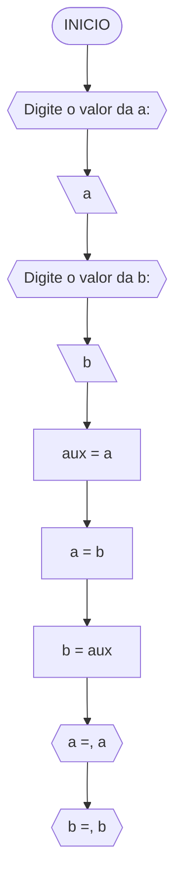
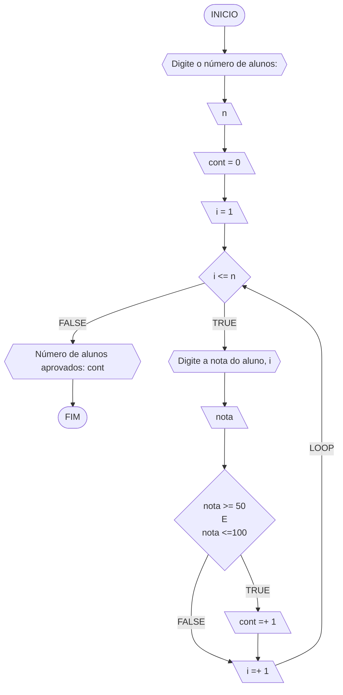
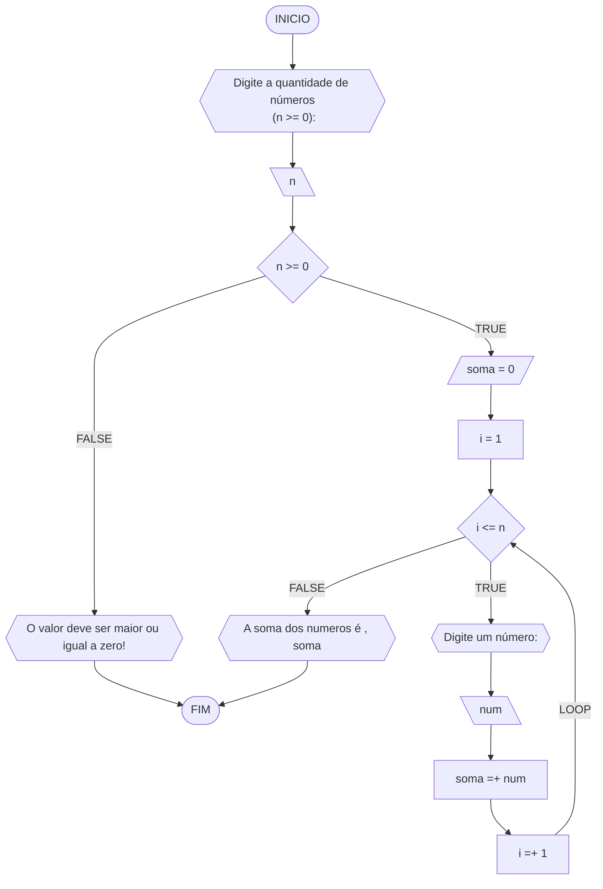
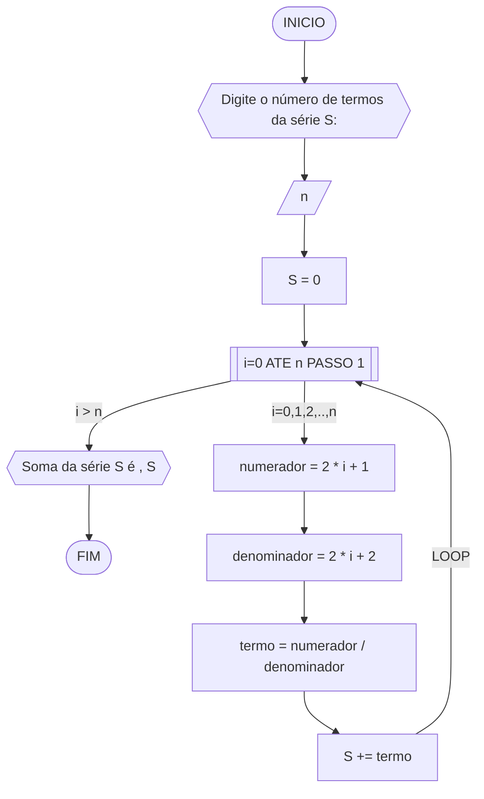
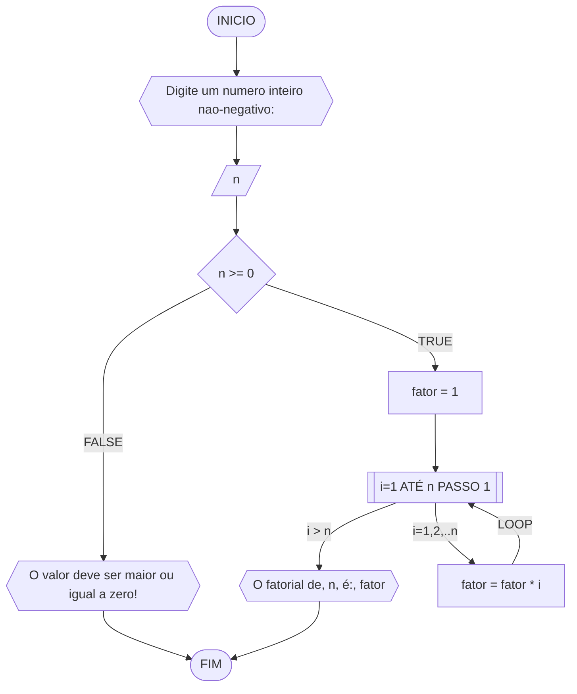
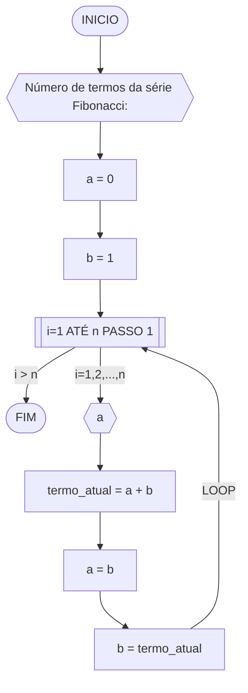
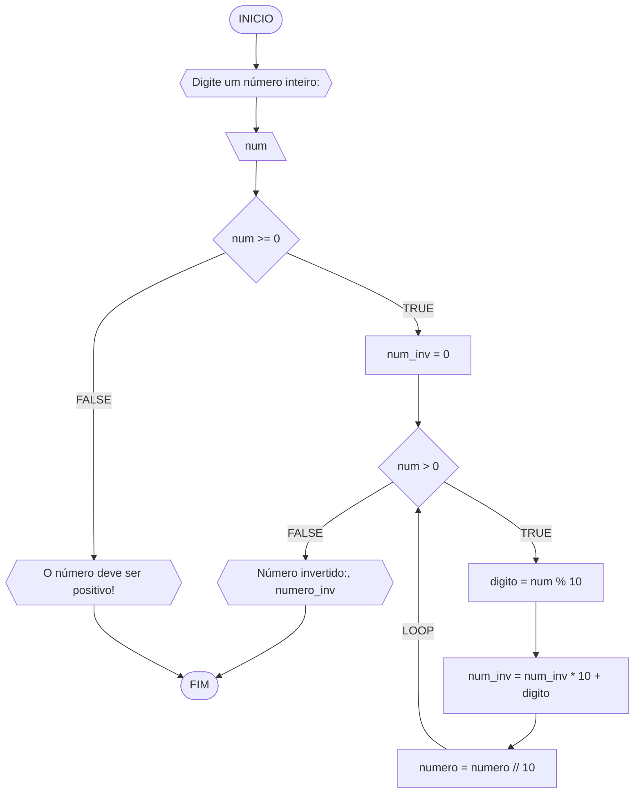

# Avaliação Diagnóstica 1

## Questão 1
Objetivo: Dadas duas variáveis, a e b, implemente e teste um algoritmo para trocar os valores atribuídos a elas.
### Fluxograma 1

### Pseudocódigo 1
```
1 ALGORITMO valores
2 INICIO
3 ESCREVA "Digite o valor de a: "
4 LEIA a
5 ESCREVA "Digite o valor da b: "
6 LEIA b
7 a = aux
8 a = b
9 b = aux
10 ESCREVA "a =", a
11 ESCREVA "b =", b
```
#### Teste de mesa 1
| a  | b  | aux | a  | b  | saída 1 | saída 2 | 
| -- | -- | --  | -- | -- | --      | --      | 
| 0  | 1  | 0   | 1  | 0  | a = 1   | b = 0   |

## Questão 2
Objetivo: Dado um conjunto n de notas de alunos em um exame, implemente e teste um algoritmo para fazer uma contagem do número de alunos que foram aprovados no exame. Será considerado aprovado o aluno que tirar nota 50 ou maior (no intervalo de 0 a 100).
### Fluxograma 2

### Pseudocódigo 2
```
1 ALGORITMO notas
2 DECLARE n, i, cont: int
3 INICIO
4 ESCREVA "Digite o número de alunos: "
5 LEIA n
6 cont = 0
7 i = 1
8 SE i <= n
9   ENTÃO ESCREVA "Digite a nota do aluno, i"
10   LEIA nota
11   SE nota >= 50 E nota <=100
12      cont =+ 1
13      i =+ 1
14    SENÃO i =+ 1
15    FIM_SE
16 SENÃO ESCREVA "Número de alunos aprovados: cont"
17 FIM_SE  
18 FIM_ALGORITMO
```
### Teste de mesa 2
| it | n  | i  | cont | i<=n  | nota, i | nota | nota_valida | cont+1 | i+1 | saída        | 
| -- | -- | -- | --   | --    | --      | --   | --          | --     | --  | --           |
| 1  | 3  | 1  |  0   | True  | nota 1  | 60   | True        | 1      | 2   |              |
| 2  | 3  | 2  |  1   | True  | nota 2  | 40   | False       | 1      | 3   |              |
| 3  | 3  | 3  |  1   | True  | nota 3  | 90   | True        | 2      | 4   |              |
| 4  | 3  | 4  |  2   | False |         |      |             |        |     | Aprovados: 2 |

## Questão 3
Objetivo:
### Fluxograma 3

### Pseudocódigo 3
```
1 ALGORITMO contagem
2 DECLARE n
3 INICIO
4 ESCREVA "Digite a quantidade de números<br> (n >= 0):"
5 LEIA n
6 SE n >= 0
7   ENTAO soma = 0
8   i = 1
9   SE i <= n
10     ENTAO ESCREVA "Digite um número: "
11     LEIA num
12     soma =+ num
13     i =+ 1
14  SENÃO ESCREVA "A soma dos numeros é , soma"
15  FIM_SE 
16 SENÃO ESCREVA "O valor deve ser maior ou igual a zero!"
17 FIM_SE
18 FIM_ALGORITMO
```
### Teste de mesa 3
| it | n  | n >= 0 | soma | i  | i <= n | num | soma =+ num  | saída                   |
| -- | -- | --     | --   | -- | --     | --  | --           | --                      |
|    | -3 | False  |      |    |        |     |              | O valor deve ser ...    |
| 1  | 0  | True   | 0    | 1  | False  |     |              | A soma dos números é 0  |
| 1  | 3  | True   | 0    | 1  | True   | 5   | 0 + 5 = 5    |                         |
| 2  | 3  | True   | 5    | 2  | True   | 10  | 5 + 10 = 15  |                         |
| 3  | 3  | True   | 15   | 3  | True   | 20  | 15 + 20 = 35 |                         |
| 4  | 3  | True   | 35   | 4  | False  |     |              | A soma dos números é 35 |

## Questão 4
Objetivo:
### Fluxograma 4

### Pseudocódigo 4
```
1 ALGORITMO somaserie
2 DECLARE n, s, i: real
3 INICIO
4 ESCREVA "Digite o número de termos da série S: "
5 LEIA n
6 S = 0
7 PARA <i> DE <0> ATE <n> [PASSO1] FAÇA
8   numerador = 2 * i + 1
9   LEIA numerador
10  denominador = 2 * i + 2
11  LEIA denominador
12  termo = numerador / denominador
13  LEIA termo
14  S += termo
15  FIM_PARA
16 ESCREVA "Soma da série S é ," S
17 FIM_ALGORITMO
```
### Teste de mesa 4
| it | n  | S  | i | numerador | denominador | termo | S += termo     | saída                  |
| -- | -- | -- |-- | --        | --          | --    | --             | --                     |
|    | 0  | 0  |   |           |             |       |                |                        |
| 1  | 4  | 0  | 0 | 2*0+1 = 1 | 2*0+2 = 2   | 1/2   | 0+1/2 = 1/2    |                        |
| 2  | 4  | 0  | 1 | 2*1+1 = 1 | 2*1+2 = 2   | 3/4   | 1/2+3/4 = 1.25 |                        |
| 3  | 4  | 0  | 2 | 2*2+1 = 1 | 2*2+2 = 2   | 5/6   | 0+1/2 = 2.08   |                        |
| 4  | 4  | 0  | 3 | 2*3+1 = 1 | 2*3+2 = 2   | 7/8   | 0+1/2 = 2.96   | Soma da série S é 2.96 |

## Questão 5
Objetivo:
### Fluxograma 5

### Pseudocódigo 5
```
1 ALGORITMO fatorial
2 DECLARE n, i, fator: int
3 INICIO
4 ESCREVA "Digite um numero inteiro nao-negativo:"
5 LEIA n
6 SE n >= 0
7   ENTAO fator = 1
8   PARA <i> DE <1> ATE n PASSO <1> FAÇA
9   LEIA i
10  fator = fator * i
11  LEIA fator
12  FIM_PARA
13 SENÃO ESCREVA "O valor deve ser maior ou igual a zero!"
14 FIM_SE
15 FIM_ALGORITMO
```
### Teste de mesa 5
| n  | fator | i  | fator = fator * i | saída               |
| -- | --    | -- | --                | --                  |
| 3  | 1     | 1  | 1*1 = 1           |                     |
| 3  | 1     | 2  | 1*2 = 2           |                     |
| 3  | 2     | 3  | 2*3 = 6           | O fatorial de 3 é 6 |

## Questão 6
Objetivo:
### Fluxograma 6

### Pseudocódigo 6
```
1 ALGORITMO fibonacci
2 DECLARE n_termos, n, i, a, b, termo_atual: int
3 INICIO
4 ESCREVA "Número de termos da série Fibonacci:"
5 LEIA n_termos
6 a = 0
7 b = 1
8 PARA <i> DE <1> ATE <n> PASSO <1> FAÇA 
9   ESCREVA "a"
10  termo_atual = a + b
11  a = b
12  b = termo_atual
13  FIM_PARA
14 FIM_ALGORITMO
```
### Teste de mesa 6
| it | n  | a  | b  | i  | saída | termo_atual = a + b | a = b | b = termo_atual |
| -- | -- | -- | -- | -- | --    | --                  | --    | --              |
| 1  | 5  | 0  | 1  | 1  | 0     | 0 + 1 = 1           | 1     | 1               |
| 2  | 5  | 1  | 1  | 2  | 1     | 1 + 1 = 2           | 1     | 2               |
| 3  | 5  | 1  | 2  | 3  | 1     | 1 + 2 = 3           | 2     | 3               |
| 4  | 5  | 2  | 3  | 4  | 2     | 2 + 3 = 5           | 3     | 5               |
| 4  | 5  | 3  | 5  | 5  | 3     | 3 + 5 = 8           | 5     | 8               |

## Questão 7
Objetivo: Implemente e teste um algoritmo para inverter a ordem dos dígitos de um número inteiro positivo.
### Fluxograma 7

### Pseudocódigo 7
```
1 ALGORITMO inverter
2 DECLARE num, digito, num_inv: int
3 INICIO
4 ESCREVA "Digite um número inteiro: "
5 LEIA num
6 SE num >= 0 ENTAO
7   num_inv = 0
8   ENQUANTO num > 0 FAÇA
9     digito = num % 10
10    num_inv = num_inv*10 + digito
11    num = num//10
12  FIM_ENQUANTO
13  ESCREVA "Número invertido:", numero_inv
14 SENÃO ESCREVA "O número deve ser positivo!"
15 FIM_SE
16 FIM_ALGORITMO
```
### Teste de mesa 7
| it | num | num_inv | num > 0 | digito | num = num // 10 | num_inv = (num_inv * 10) + digito | Saída                       |
| -- | --  | --      | --     | --      | --              | --                                | --                          |
|    | -1  | 0       | False  |         |                 |                                   | O número deve ser positivo! |
| 1  | 0   | 0       | False  |         |                 |                                   | Número invertido:: 0        |
| 1  | 42  | 0       | True   | 2       | 4               | 2                                 |                             |
| 2  | 4   | 2       | True   | 4       | 0               | 24                                |                             |
| 3  | 0   | 24      | False  |         |                 |                                   | Número invertido:: 24       |
