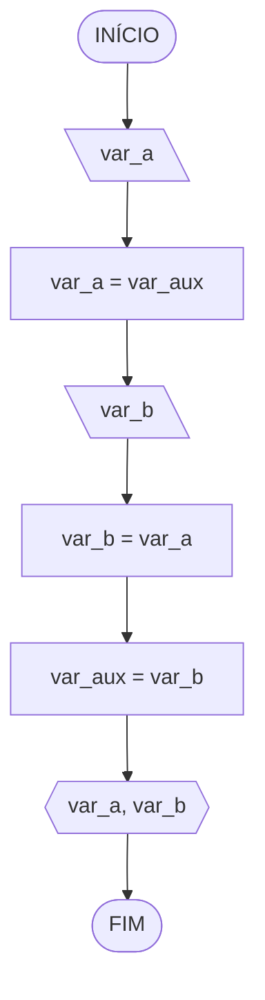

# Avaliação Diagnóstica 1

## Questão 1
Objetivo: Trocar os valores de duas variáveis
### Fluxograma 1

## Questão 2
Objetivo: Fazer uma contagem do número de alunos que foram aprovados no exame.
### Fluxograma 2
