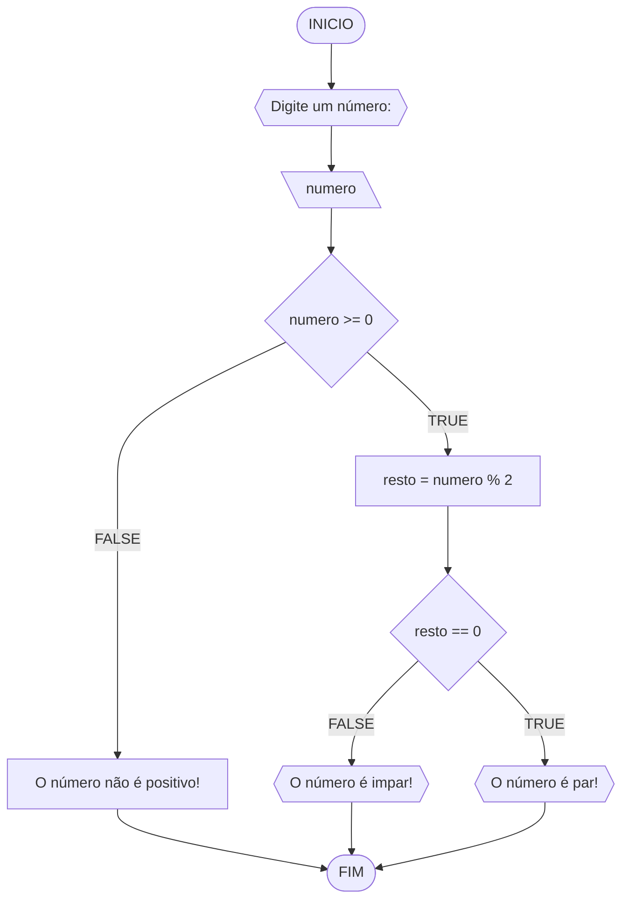
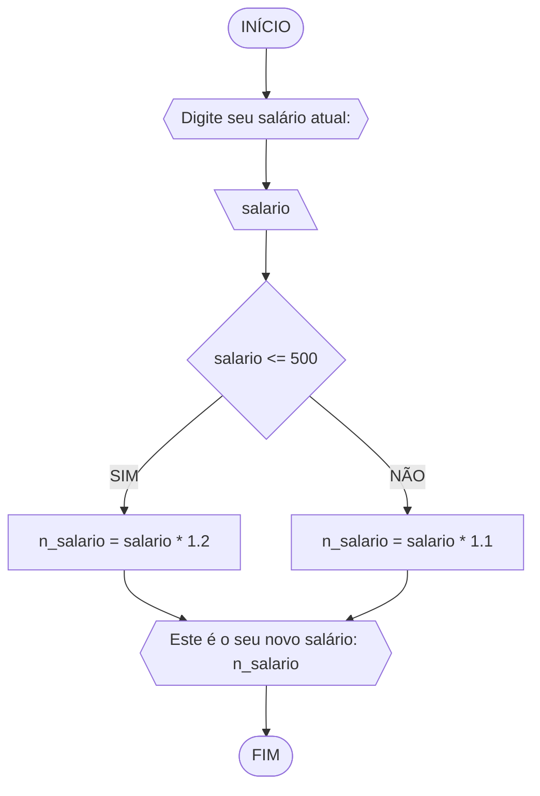
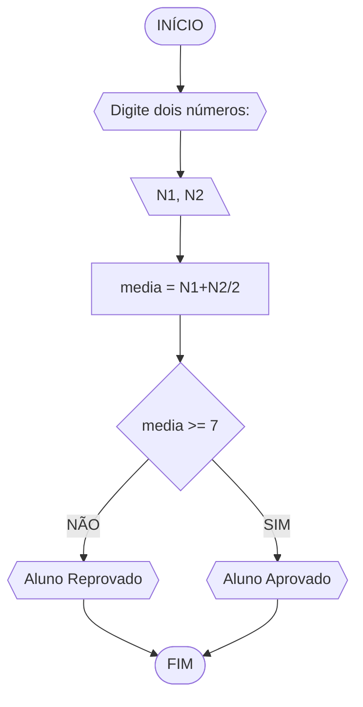
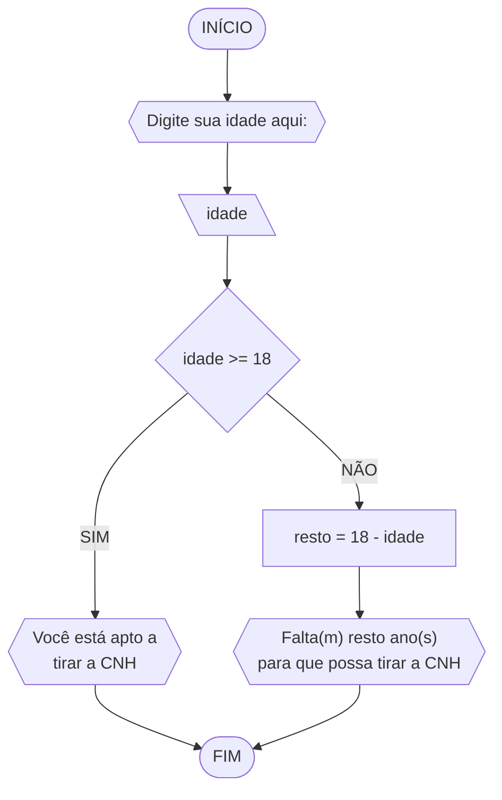

# Unifor
**Nome:** Danilo Ribeio Santos

**Disciplina:** Raciocínio Lógico Algorítmico
## Exercício 1
Objetivo: Represente, em fluxograma e pseudocódigo, um algoritmo para determinar se um número inteiro e positivo é par ou impar.
#### Fluxograma 1

#### Pseudocódigo 1
```
1  ALGORTIMO verifica_par_impar
2  DECLARE numero, resto: INTEIRO
3  ESCREVA "Digite um número: "
4  INICIO
4  LEIA numero
5  SE numero >= 0 ENTAO                  // verifica se o inteiro é positivo
6    resto = numero % 2                 // calcula o resto da divisão por 2
7    SE resto == 0 ENTAO                // verifica se o resto é igual a zero
8      ESCREVA "O número é par!"
9    SENAO
10     ESCREVA "O número é impar!"
11   FIM_SE
11 SENAO                                // caso inteiro for negativo (condição linha 5)
12    ESCREVA "O número deve ser postivo!"
13 FIM_SE
13 FIM
```
#### Teste de mesa 1
| numero | numero >= 0 | resto | resto == 0 | Saída |
| -- | -- | -- | -- | -- | 
| -1 | F | - | - | "O número deve ser postivo!" |
| 0  | V | 0 | V | "O número é par!" |
| 13 | V | 1 | F | "O número é impar!" |
| 30 | V | 0 | V | "O número é par!" |

## Exercício 02
Objetivo: Represente, em fluxograma e pseudocódigo, um algoritmo para calcular o novo salário de um funcionário. 
Sabe-se que os funcionários que recebem atualmente salário de até R$ 500 terão aumento de 20%; os demais terão aumento de 10%.
#### Fluxograma 2

#### Pseudocódigo 2
```
1 ALGORITMO salario
2 DECLARE salario, n_salario NUMERICO
3 ESCREVA "Digite seu salário atual: "
4 LEIA salario
5 SE salario <= 500
6 	ENTÃO n_salario = salario * 1.2
7 SENÃO
8 	n_salario = salario * 1.1
9 FIM_SE
10 ESCREVA "Este é o seu novo salário: "n_salario
11 FIM
```
#### Teste de mesa 2
| salario | salario <= 500 | n_salario |
|---------|:--------------:|-----------|
| 400     |      True      | 480       |
| 500     |      True      | 600       |
| 600     |      False     | 660       |
| 1000    |      False     | 1100      |

## Exercício 03
Objetivo: Represente, em fluxograma e pseudocódigo, um algoritmo para calcular a média aritmética entre duas notas de um aluno e mostrar sua situação, que pode ser aprovado ou reprovado.
#### Fluxograma 3

#### Pseudocódigo 3
```
1 ALGORITMO media
2 DECLARE N1, N2, media NUMERICO
3 INÍCIO
4 ESCREVA "Digite dois números"
5 LEIA N1, N2, 
6 media = N1+N2/2
7 SE media >= 7
8 	ENTÃO ESCREVA "Aluno Aprovado"
9 SENÃO ESCREVA "Aluno Reprovado"
10 FIM_SE
11 FIM
```
#### Teste de mesa 3
| N1 | N2 | media | media >= 7 |      saída      |
|----|----|-------|------------|:---------------:|
| 3  | 4  | 6     | False      | Aluno Reprovado |
| 6  | 7  | 6,5   | False      | Aluno Reprovado |
| 8  | 9  | 8,5   | True       |  Aluno Aprovado |
| 7  | 7  | 7     | True       | Aluno Aprovado  |

## Exercício 04
Objetivo: Represente, em fluxograma e pseudocódigo, um algoritmo que, a partir da idade do candidato(a), determinar se pode ou não tirar a CNH. Caso não atender a restrição de idade, calcular quantos anos faltam para o candidato estar apto.
#### Fluxograma 4

#### Pseudocódigo 4
```
1 ALGORITMO cnh
2 DECLARE idade, resto NUMERICO
3 INÍCIO
4 ESCREVA "Digite sua idade aqui: "
5 LEIA idade
6 SE idade >= 18
7  ENTÃO ESCREVA "Você está apto a tirar a CNH"
8 SENÃO
9 	resto = 18 - idade
10 	ESCREVA "Falta(m)"resto"ano(s) para 
11 	que possa tirar a CNH"
12  FIM_SE
13 FIM
```
#### Teste de mesa 4
|    nome   | idade | idade >= 18 | resto |                   saída                   |
|:---------:|:-----:|:-----------:|:-----:|:-----------------------------------------:|
|   Danilo  |   18  |     True    |   -   |        Você está apto a tirar a CNH       |
|   Jorge   |   17  |    False    |   1   |   Falta 1 ano para que possa tirar a CNH  |
| Clarêncio |   5   |    False    |   13  | Faltam 13 anos para que possa tirar a CNH |
