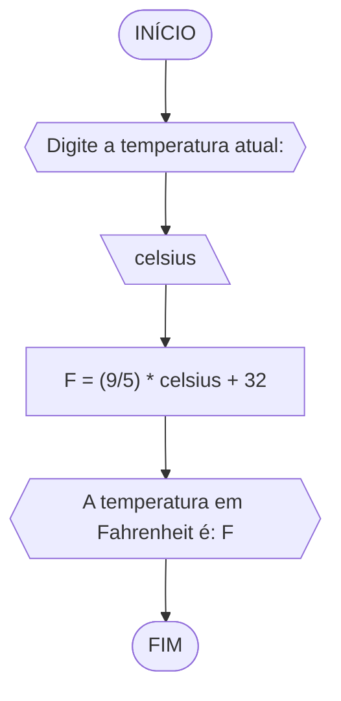

# Unifor
**Nome:** Danilo Ribeio Santos
**Disciplina:** Raciocínio Lógico Algorítmico
## Exercício 1
Calcule a média de quartro números inteiros dados:
### Fluxograma 1

### Pseudocódigo 1
```
1 ALGORITMO media
2 DECLARE N1, N2, N3, N4, media: int
3 INICIO
4 ESCREVA "Digite quatro números inteiros: "
5 LEIA N1, N2, N3, N4
6 media = (N1+N2+N3+N4)/4
7 ESCREVA "A média é: "media
8 FIM_ALGORITMO
```
### Teste de Mesa 1
|N1|N2|N3|N4|somatória| media |
|-|-|-|-|-|-|
|1|5|9|13|28|7
|2|6|10|14|32|8
|3|7|11|15|36|9
## Exercício 2
Objetivo: Leia uma temperatura dada na escala Celsius (C) e imprima o equivalente em Fahrenheit.
### Fluxograma 2

### Pseudocódigo 2
```
1 ALGORITMO fahrenheit
2 DECLARE celsius, F: real
3 INICIO
4 ESCREVA "Digite a temperatura atual: "
5 LEIA celsius
6 F = (9/5) * celsius + 32
7 ESCREVA "A temperatura em Fahrenheit é: "F
8 FIM
```
### TESTE
|Celsius (C°)|Fahrenheit (F°)|
|      -     |       -       |
|      0     |       32      |
|     20     |       68      |
|     100    |      212      |
