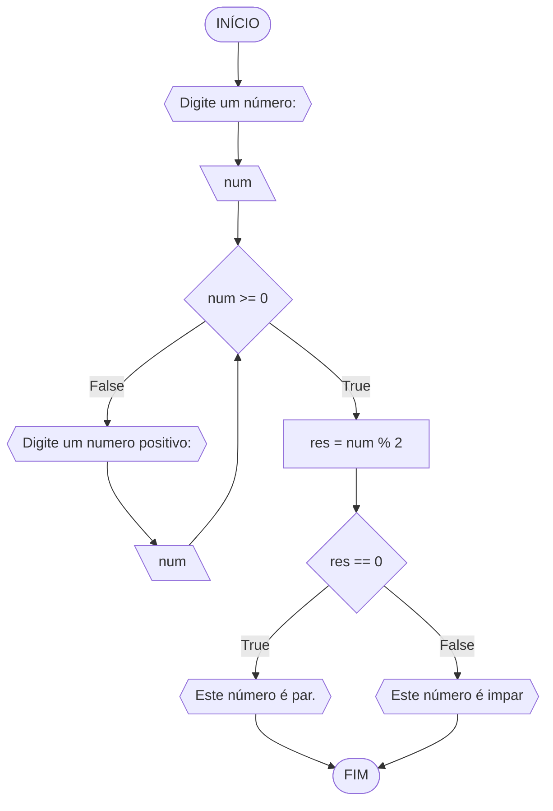
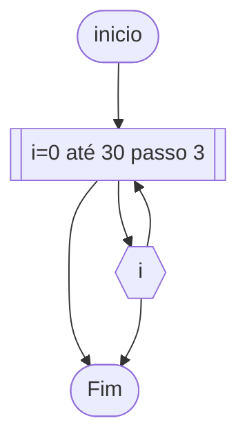
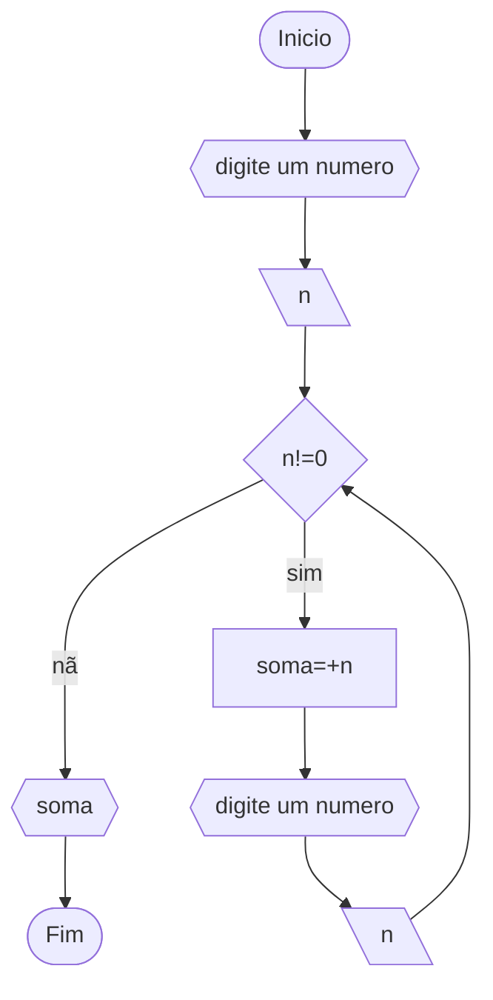
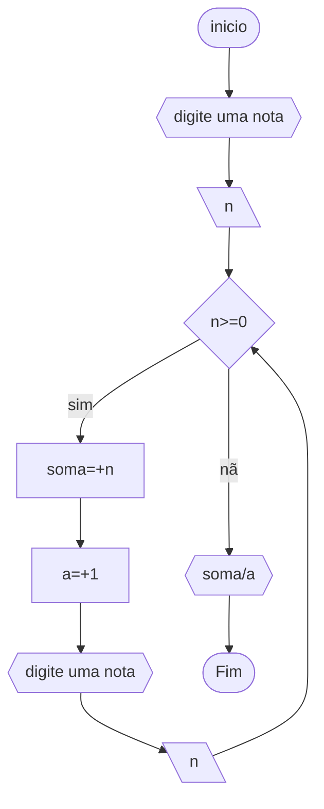

# Unifor
**Nome:** Danilo Ribeio Santos

**Disciplina:** Raciocínio Lógico Algorítmico
## Exercício 1
Objetivo: Atualize o algoritmo para determinar se um número inteiro e positivo é par ou ímpar, usando uma laço condicional para aceitar apenas números maiores ou iguais a zero.
### Fluxograma 1

### Pseodocódigo 1
```
ALGORITMO impar_par
DECLARE n: INTEIRO
INICIO
ESCREVA "digite um numero"
LEIA n
	SE (n<0)ENTÃO
		ESCREVA "numero negativo"
	SENÃO
		SE (n%2==0) ENTÃO
			ESCREVA "par"
		SENÃO 
			ESCREVA"impar"
		FIM_SE
	FIM_SE
FIM
```
### Teste de mesa 1
| entrada | negativo | positivo | impar | par | saida |
|--|--|--|--|--|--|
| 1 | nao | sim | sim | nao| impar|
| 2 |nao | sim | nao | sim| par|
| 12 |nao | sim | nao | sim| par|
| -1 | sim | nao |  | | numero negativo|

## Exercício 2
Objetivo: Faça um algoritmo que exiba na tela uma contagem de 0 até 30, exibindo apenas os múltiplos de 3.
### Fluxograma 2

### Pseudocódigo 2
```
ALGORITMO multiplo
DECLARE i: INTEIRO
INICIO
i<--0
PARA i DE 1 ATÉ 30 PASSO 3 FAÇA
ESCREAVA i
FIM_PARA
FIM
```
### Teste de mesa 2
0|3|6|9|12|15|18|21|24|27|30
|-|-|-|-|-|-|-|-|-|-|-|

## Exercício 3
Objetivo: Dada uma sequência de números inteiros, calcular a sua soma. Por exemplo, para a sequência {12, 17, 4, -6, 8, 0}, o seu programa deve escrever o número 35.
### Fluxograma 3 

### Pseudocódigo 3
```
ALGORITMO soma
DECLARE n, soma: NUMERICO
INICIO
ESCREVA "digite um numero"
LEIA n
soma<--0
	ENQUANTO (n!=0) FAÇA
		soma=+n
		ESCREVA "digite um numero"
		LEIA n
	FIM_ENQUANTO
	ESCREVA soma
FIM
```
### Teste de mesa 3
ordem|numero|n!=0|soma|saída
-|-|-|-|-
1|1|sim|1
2|2|sim|3
3|3|sim|6
4|4|sim|10
5|0|não|10|10

## Exercício 4
Objetivo: Escreva um programa que leia a nota de diversos alunos, até que seja digitada uma nota negativa. Nesse momento, ele mostra a média aritmética de todas as notas lidas e quantas notas foram lidas. Ex. Foram lidas 14 notas. A média aritmética é 6.75!
### Fluxograma 4

### Pseudocodigo 4
```
ALGORITMO media
DECLARE n, a, soma: NUMERICO
INICIO
soma <-- 0
a <-- 0
ESCREVA "digite uma nota"
LEIA n
	SE (n>=0) ENTÃO
		soma <-- +n
		a <-- +1
		ESCREVA "digite uma nota"
		LEIA n
	SENÃO 
		ESCREVA soma/a
	FIM_SE 
FIM
```
### Teste de mesa 4
nota | é >=0 | soma | a | saída
-|-|-|-|-
8|sim|8|1
7|sim|15|2
9|sim|24|3
5|sim|29|4
9|sim|38|5
-3|nao|38|5|7.6
