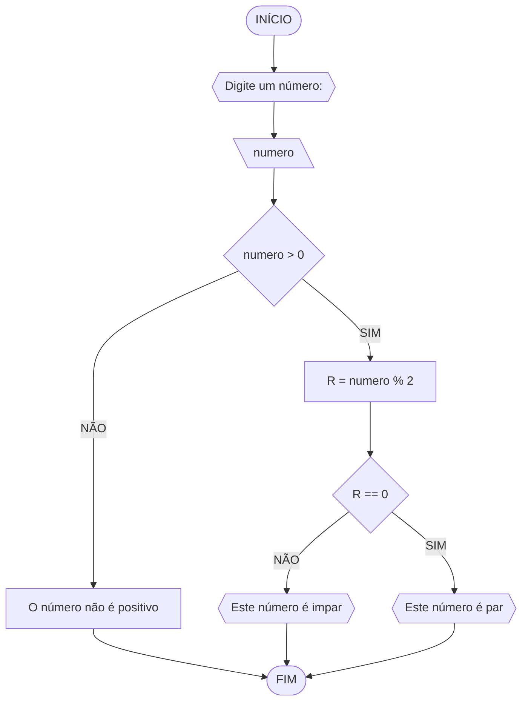

# UNIFOR 
**Nome**: Danilo Ribeiro

**Disciplina**: Raciocínio Lógico Algorítmico
### Fluxograma 3 (PAR ou IMPAR)

```mermaid
flowchart TD
A([INÍCIO]) --> B{{"Digite um número:"}}
B --> C[\numero\]
C --> D{numero > 0}
D --NÃO--> E["O número não é positivo"]
D --SIM--> F[R = numero % 2]
E --> Z([FIM])
F --> G{R == 0}
G --NÃO--> H{{Este número é impar}}
G --SIM--> I{{Este número é par}}
H --> Z
I --> Z
```
