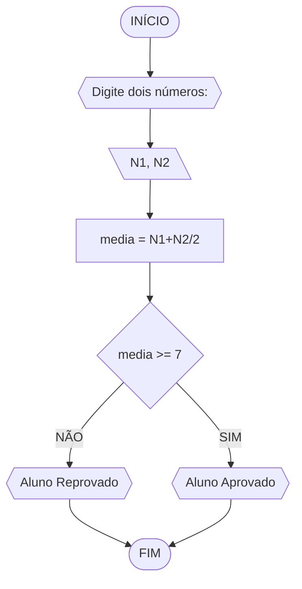
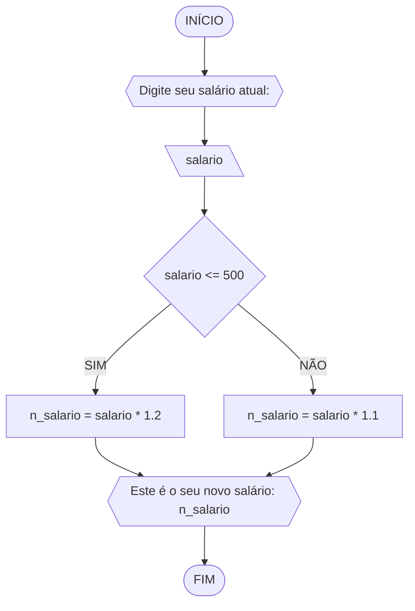
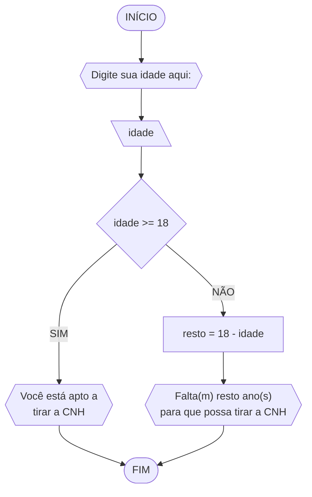

# UNIFOR 
**Nome**: Danilo Ribeiro

**Disciplina**: Raciocínio Lógico Algorítmico

**Turma**: T160-39
### Fluxograma 1 (MÉDIA)

### Pseudocódigo 1
```
1 ALGORITMO media
2 DECLARE N1, N2, media NUMERICO
3 ESCREVA "Digite dois números"
4 LEIA N1, N2, 
5 media = N1+N2/2
6 SE media >= 7
7 	ENTÃO ESCREVA "Aluno Aprovado"
8 SENÃO
9 	ESCREVA "Aluno Reprovado"
10 FIM_ALGORITMO
```
### Fluxograma 2 (SALÁRIO)

### Pseudocódigo 2
```
1 ALGORITMO salario
2 DECLARE salario, n_salario NUMERICO
3 ESCREVA "Digite seu salário atual: "
4 LEIA salario
5 SE salario <= 500
6 	ENTÃO n_salario = salario * 1.2
7 SENÃO
8 	n_salario = salario * 1.1
9 	ESCREVA "Este é o seu novo salário: "n_salario
10 FIM_ALGORITMO
```
### Fluxograma 3 (PAR ou IMPAR)

### Pseudocódigo 3
```
1 ALORITMO par_impar
2 DECLARE numero, R NUMERICO 
3 ESCREVA "Digite um número:"
4 LEIA numero
5 SE numero > 0 ENTÃO
6	R = numero % 2
7		SE R == 0 ENTÃO
8			ESCREVA "O número é par"
9		SENÃO
10			ESCREVA "O número é impar"
11 SENÃO
12 	ESCREVA "O número não é positivo
13 FIM_ALGORITMO
```
### Fluxograma 4 (CNH)

### Pseudocódigo 4
```
1 ALGORITMO cnh
2 DECLARE idade, resto NUMERICO
3 ESCREVA "Digite sua idade aqui: "
4 LEIA idade
5 SE idade >= 18
6 	ENTÃO ESCREVA "Você está apto a tirar a CNH"
7 SENÃO
8 	resto = 18 - idade
9 	ESCREVA "Falta(m)"resto"ano(s) para 
10 	que possa tirar a CNH"
11 FIM_ALGORITMO
```

