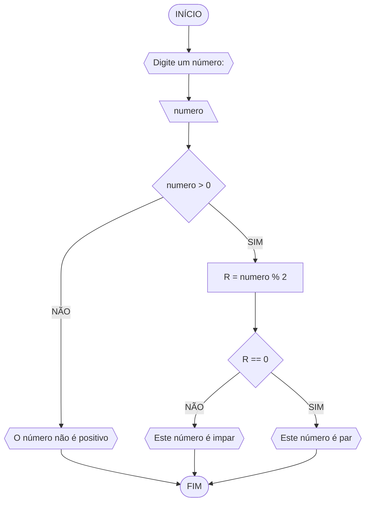

# UNIFOR 
**Nome**: Danilo Ribeiro

**Disciplina**: Raciocínio Lógico Algorítmico
### Fluxograma 1 (MÉDIA)


### Fluxograma 3 (PAR ou IMPAR)

### Pseudocódigo
```
1 ALORITMO par_impar
2 DECLARE numero, R NUMERICO 
3 ESCREVA "Digite um número:"
4 LEIA numero
5 SE numero > 0 ENTÃO
6	R = numero % 2
7		SE R == 0 ENTÃO
8			ESCREVA "O número é par"
9		SENÃO
10			ESCREVA "O número é impar"
11 SENÃO
12 	ESCREVA "O número não é positivo
13 FIM_ALGORITMO
```
