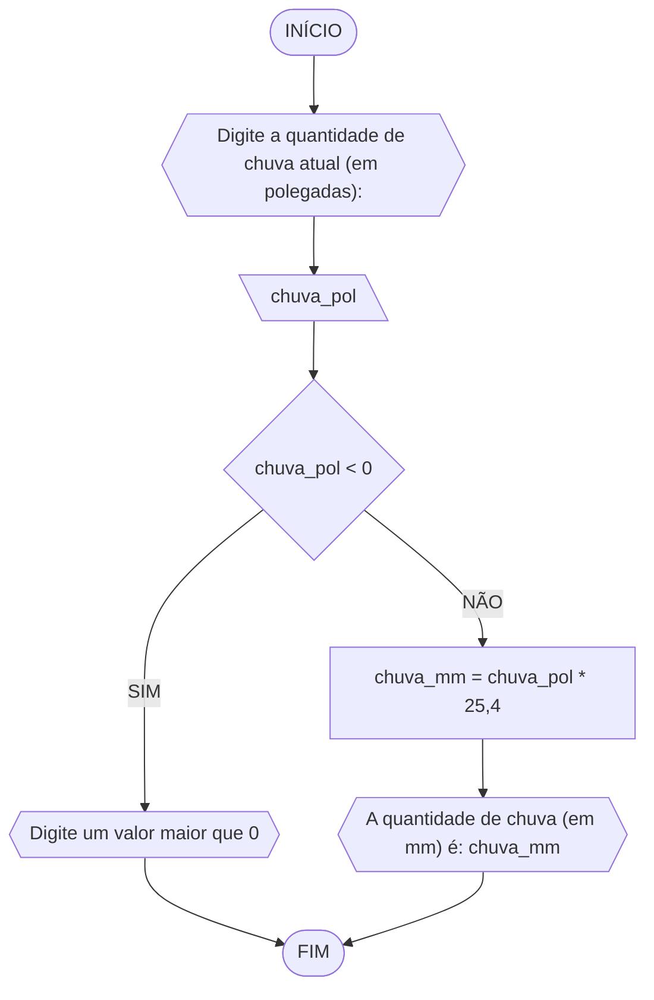

## Exercício 2 (Fahrenheit)
Objetivo: Leia uma temperatura dada na escala Celsius (C) e imprima o equivalente em Fahrenheit.
### Fluxograma 2

### Pseudocódigo 2
```
1 ALGORITMO fahrenheit
2 DECLARE celsius, F: real
3 INICIO
4 ESCREVA "Digite a temperatura atual: "
5 LEIA celsius
6 F = (9/5) * celsius + 32
7 ESCREVA "A temperatura em Fahrenheit é: "F
8 FIM
```
### TESTE
|Celsius (C°)|Fahrenheit (F°)|
|-|-|
|0|32|
|20|68|
|100|212|

## Exercício 3 (Chuva)
Objetivo: Leia uma quantidade de chuva dada em polegadas e imprima o equivalente em milímetros.
### Fluxograma 3

### Pseudocódigo 3
```
1 ALGORITMO chuva_mm
2 DECLARE chuva_pol, chuva_mm: real
3 INICIO
4 ESCREVA "Digite a quantidade de chuva atual (em polegadas): "
5 LEIA chuva_pol
6 SE chuva_pol < 0
7 	ESCREVA "Digite um valor maior que 0"
8 SENÃO chuva_mm = chuva_pol * 25,4
9 ESCREVA "A quantidade de chuva (em mm) é: "chuva_mm
10 FIM
```
### TESTE


