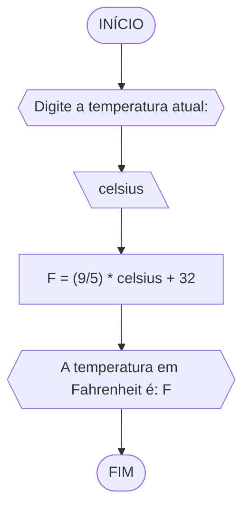

### Exercício 2 (Fahrenheit)
Objetivo: Leia uma temperatura dada na escala Celsius (C) e imprima o equivalente em Fahrenheit.
### Fluxograma 2

### Pseudocódigo 2
```
1 ALGORITMO fahrenheit
2 DECLARE celsius, F: real
3 INICIO
4 ESCREVA "Digite a temperatura atual: "
5 LEIA celsius
6 F = (9/5) * celsius + 32
7 ESCREVA "A temperatura em Fahrenheit é: "F
8 FIM
```
### TESTE
|Celsius (C°)|Fahrenheit (F°)|
|-|-|
|0|32|
|20|68|
|100|212|


