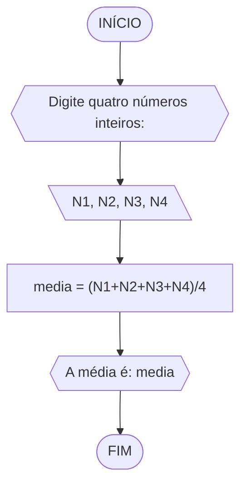
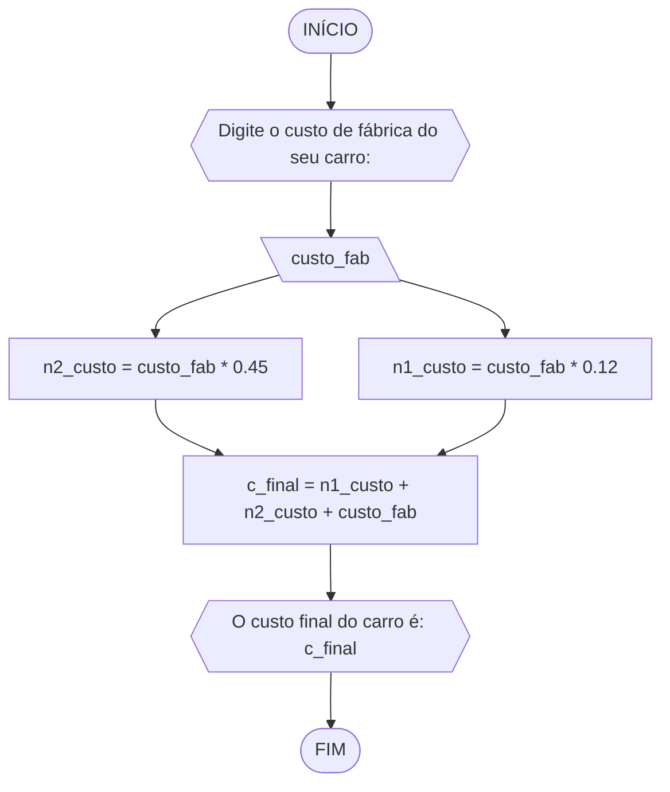
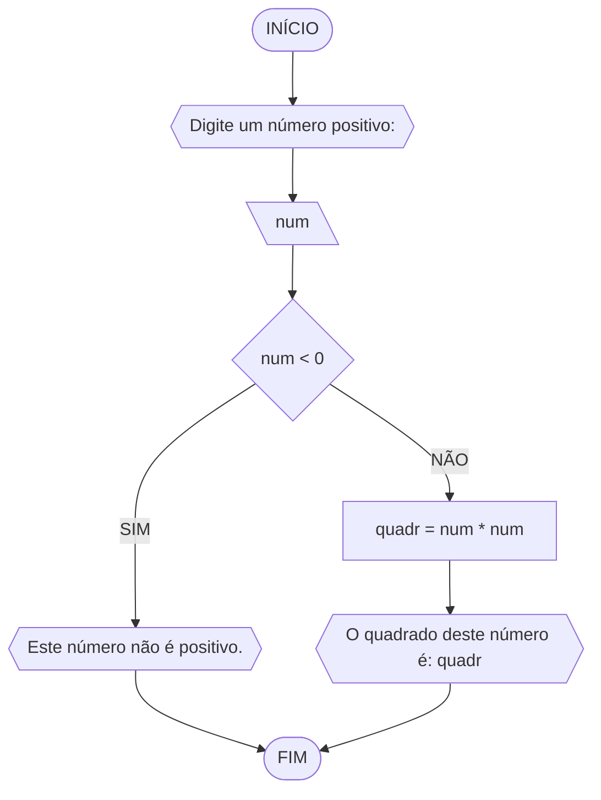
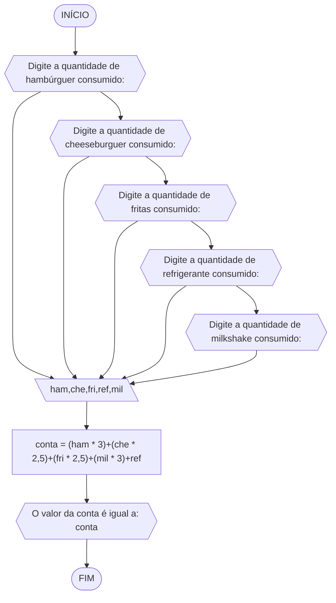
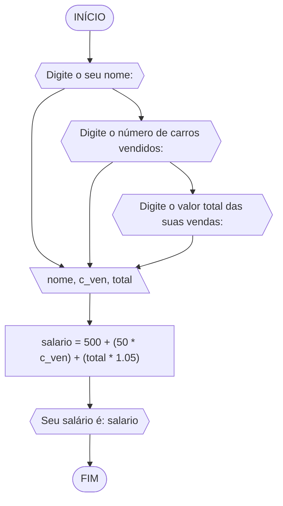
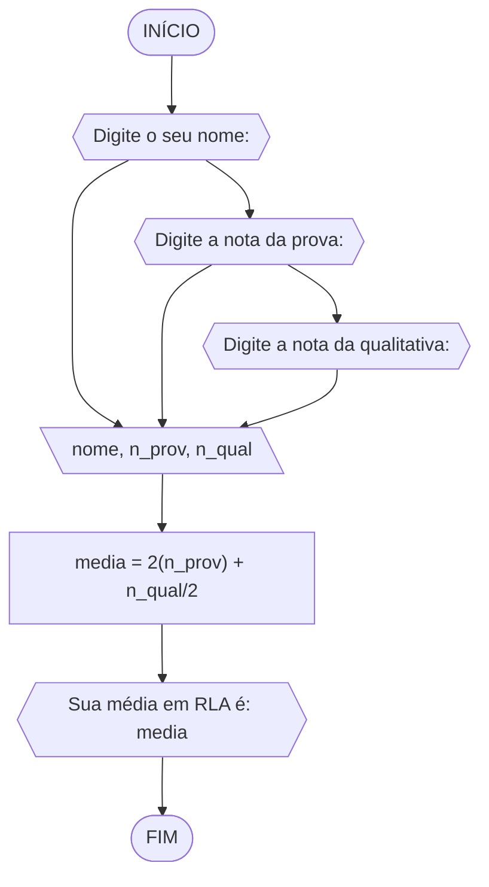
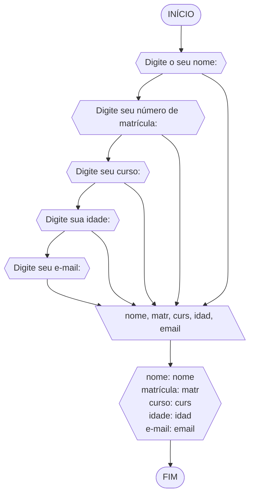
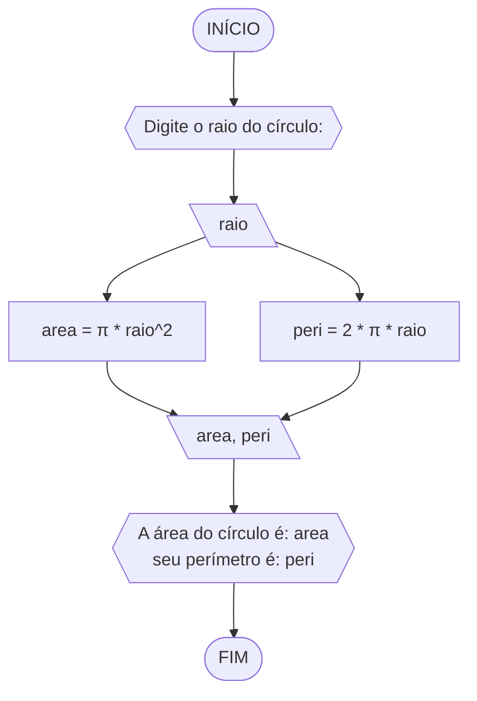

## Exercício 1
Objetivo: Calcule a média de quatro números inteiros dados.
### Fluxograma 1

### Pseudocódigo 1
```
1 ALGORITMO media
2 DECLARE N1, N2, N3, N4, media: int
3 INICIO
4 ESCREVA "Digite quatro números inteiros: "
5 LEIA N1, N2, N3, N4
6 media = (N1+N2+N3+N4)/4
7 ESCREVA "A média é: "media
8 FIM
```
### TESTE
|N1|N2|N3|N4|somatória| media |
|-|-|-|-|-|-|
|1|5|9|13|28|7
|2|6|10|14|32|8
|3|7|11|15|36|9
## Exercício 2
Objetivo: Leia uma temperatura dada na escala Celsius (C) e imprima o equivalente em Fahrenheit.
### Fluxograma 2

### Pseudocódigo 2
```
1 ALGORITMO fahrenheit
2 DECLARE celsius, F: real
3 INICIO
4 ESCREVA "Digite a temperatura atual: "
5 LEIA celsius
6 F = (9/5) * celsius + 32
7 ESCREVA "A temperatura em Fahrenheit é: "F
8 FIM
```
### TESTE
|Celsius (C°)|Fahrenheit (F°)|
|-|-|
|0|32|
|20|68|
|100|212|

## Exercício 3
Objetivo: Leia uma quantidade de chuva dada em polegadas e imprima o equivalente em milímetros.
### Fluxograma 3

### Pseudocódigo 3
```
1 ALGORITMO chuva_mm
2 DECLARE chuva_pol, chuva_mm: real
3 INICIO
4 ESCREVA "Digite a quantidade de chuva atual (em polegadas): "
5 LEIA chuva_pol
6 SE chuva_pol < 0
7 	ESCREVA "Digite um valor maior que 0"
8 SENÃO chuva_mm = chuva_pol * 25,4
9 ESCREVA "A quantidade de chuva (em mm) é: "chuva_mm
10 FIM
```
### TESTE
|Polegadas (pol)|milímetro (mm)|
|-|-|
|1|25,4|
|50|1270|
|200|5080|
## Exercício 4
Objetivo: Prepare um algoritmo para ler o custo de fábrica do carro e imprimir o custo ao consumidor.  
### Fluxograma 4

### Pseudocódigo 4
```
1 ALGORITMO carro
2 DECLARE custo_fab, n1_custo, n2_custo, c_final: real
3 INICIO
4 ESCREVA "Digite o custo de fábrica do seu carro: "
5 LEIA custo_fab
6 n1_custo = custo_fab * 0.12
7 n2_custo = custo_fab * 0.45
8 c_final = n1_custo + n2_custo + custo_fab
9 ESCREVA "O custo final do carro é: "c_final
10 FIM
```
### TESTE
|custo de fábrica |imposto|distribuidor|custo final
|-|-|-|-|
|1000|450|120|1570
|20000|9000|2400|31400
|60000|27000|7200|94200
## Exercício 5
Objetivo: Calcule o quadrado de um número.
### Fluxograma 5

### Pseudocódigo 5
```
1 ALGORITMO quadrado
2 DECLARE num, quadr: int
3 INICIO
4 ESCREVA "Digite um número positivo: "
5 LEIA num
6 SE num < 0
7 	ENTÃO ESCREVA "Este número não é positivo"
8 SENÃO quadr = num * num
9 ESCREVA "O quadrado deste número é: "quadr
10 FIM
```
### TESTE
|número|número ao quadrado|
|-|-|
|2|4|
|10|100|
|50|2500|
## Exercício 6
Objetivo: Prepare um algoritmo para ler o cardápio.
### Fluxograma 6

### Pseudocódigo 6
```
1 ALGORITMO cardapio
2 DECLARE ham,che,fri,ref,mil: int
3 INICIO
4 ESCREVA "Digite a quantidade de hambúrguer consumido: "
5 ESCREVA "Digite a quantidade de cheeseburguer consumido: "
6 ESCREVA "Digite a quantidade de fritas consumido: "
7 ESCREVA "Digite a quantidade de refrigerante consumido: "
8 ESCREVA "Digite a quantidade de milkshake consumido: "
9 LEIA ham,che,fri,ref,mil
10 conta = (ham * 3)+(che * 2,5)+(fri * 2,5)+(mil * 3)+ref
11 ESCREVA "O valor da conta é igual a: "conta
12 FIM
```
### TESTE
| ham | che | fri | ref | mil | total_gasto |
|---|---|---|---|---|---|
| 1 | 2 | 1 | 2 | 4 | 24,50 |
| 2 | 3 | 3 | 4 | 3 | 34,00 |
| 3 | 4 | 5 | 6 | 2 | 43,50 |
## Exercício 7
Objetivo: Elabore um algoritmo para calcular o salário de um vendedor num dado mês.
### Fluxograma 7

### Pseudocódigo 7
```
1 ALGORITMO carros
2 DECLARE c_ven, total, salario: real
3       nome: caractere
4 INICIO
5 ESCREVA "Digite o seu nome: "
6 ESCREVA "Digite o número de carros vendidos: "
7 ESCREVA "Digite o valor total das suas vendas: "
8 LEIA nome, c_ven, total
9 salario = 500 + (50 * c_ven) + (total * 1.05)
10 ESCREVA "Seu salário é: "salario
11 FIM
```
### TESTE
|nome|c_ven|total|salario
|-|-|-|-
|Danilo|20|187900|198795
|Danilo|12|143000|151250
|Danilo|8|98000|103800	
## Exercício 8
Objetivo: Calcule a média de um aluno na disciplina RLA.
### Fluxograma 8

### Pseudocódigo 8
```
1 ALGORITMO rla 
2 DECLARE n_prov, n_qual: real
3 		nome: caractere
4 INICIO
5 ESCREVA "Digite o seu nome: "]
6 ESCREVA "Digite a nota da prova: "
7 ESCREVA "Digite a nota da qualitativa: "
8 LEIA nome, n_prov, n_qual
9 media = 2(n_prov) + n_qual/2
10 ESCREVA "Sua média em RLA é: "media
11 FIM
```
### TESTE

## Exercício 9
Objetivo: Crie uma ficha preenchida com os dados do usuário.
### Fluxograma 9

### Pseudocódigo 9
```
1 ALGORITMO fichario
2 DECLARE matrícula, idade: int
3 		nome, curso, e-mail: caractere
4 INICIO
5 ESCREVA "Digite o seu nome: "
6 ESCREVA "Digite seu número de matrícula: "
7 ESCREVA "Digite seu curso: "
8 ESCREVA "Digite sua idade: "
9 ESCREVA "Digite seu e-mail: "
10 LEIA nome, matr, curs, idad, email
11 ESCREVA "nome: nome
12	matrícula: matr
13	curso: curs
14	idade: idad
15	e-mail: email"
16 FIM		
```
### TESTE

## Exercício 10
Objetivo:
### Fluxograma 10

### Pseudocódigo 10
```
1 ALGORITMO circulo
2 DECLARE raio, area, peri: real
3 INICIO
4 ESCREVA "Digite o raio do círculo: "
5 LEIA raio
6 area = π * raio^2
7 peri = 2 * π * raio
8 LEIA area, peri
9 ESCREVA "A área do círculo é: area
	seu perímetro é: peri"
10 FIM
```
### Teste
